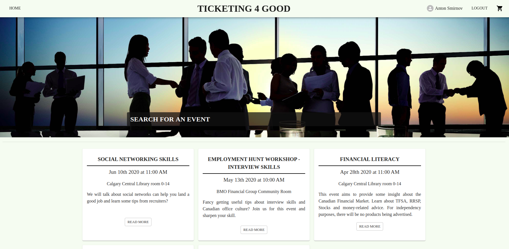

# Ticketing 4 Good Application
Ticketing 4 Good is a web app built by Anton Smirnov and Thiago Almedia. It was built as a final project for LighthouseLabs coding bootcamp. ReactJS and Material UI have been used to create this app.
This repo is a frontend part. To check the backend part please visit this link [Backend](https://github.com/tbalmeida/ticketing-api/)

To see a production version on Netlify please go here [Netlify](https://ticketing4good.netlify.com/)

## Setup

Install dependencies with `npm install`.

## Screenshot of the app

Main page

